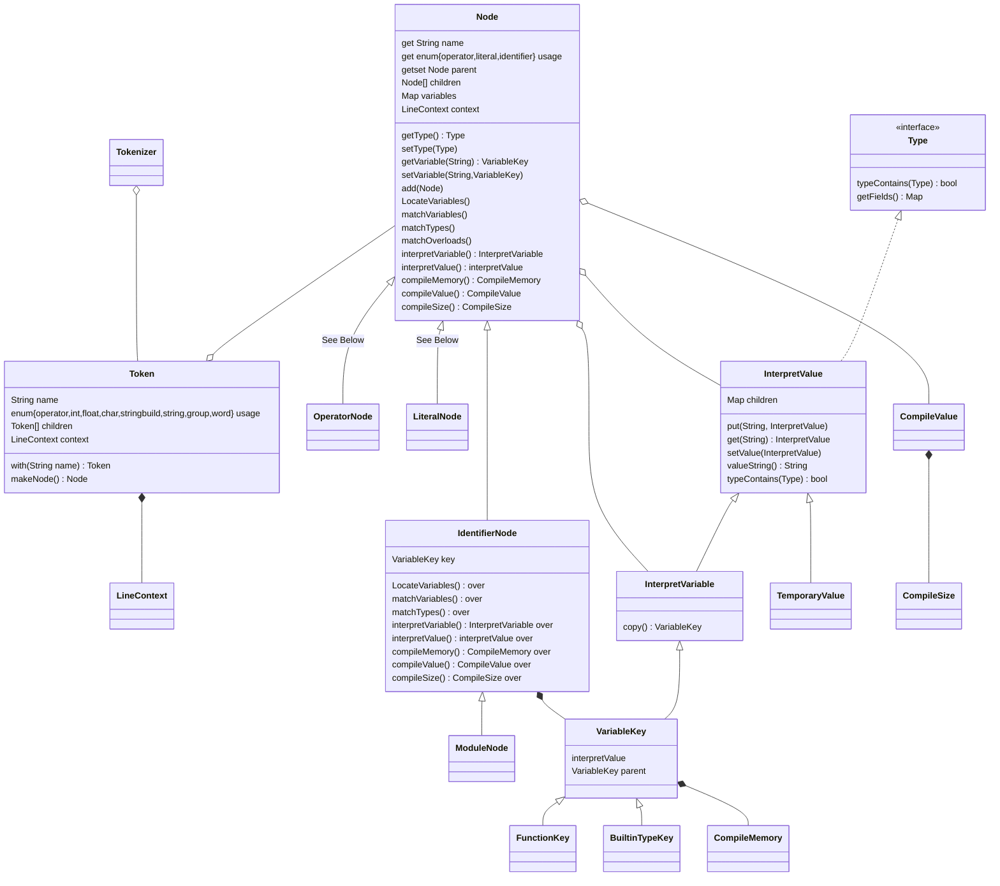

# Implementation

## Parts of the interpreter-compiler

|Component|Role|
|--|--|
|Tokenizer|takes in a file and breaks it into processable Tokens that have a heirarchial structure that account for parenthesis and tabification|
|Syntax Tree|stores the components of the program in an organized format to be used to find variables, match types, interpreted, or compiled|
|Variable|provides the Variable Key that is shared between occurances of variable identifiers and also describes the type of the variable|
|Interpreter|provides the classes that are used for interpretation|
|Compiler|provides the classes that are used for compilation|

## Classes

|Class|Role|
|--|--|
|Buffer|keeps track of the position of a file while spitting out contents of the file line-by-line. Also allows un-getting part of the most recent line|
|LineContext|the information regarding a token's position, value, and the rest of its line that is used to display errors|
|**Node**|the ancestral class for all syntax tree nodes|
|**ModuleNode**|the node for a folder|
|**IdentifierNode**|the node for a variable. Variables are declared by their first use|
|**OperatorNode**|the node for an operator|
|**LiteralNode**|the node for a literal|
|GenericOperatorNode|any operator that handles only values (ie arithmetic, boolean)|
|AssignNode|used to assign a variable|
|DefineNode|used to define a function|
|FieldNode|used to access a field. Fields are declared by their first use|
|ToNode|converts a value to a copy with the type specified|
|AsNode|treats a value as the type specified|
|CallNode|calls a function|
|ControlNode|ancestral class for the control statement classes|
|LambdaNode|the "value" of a function|
|CharNode||
|StringNode|stores a string. Possibly with embeds|
|IntNode||
|FloatNode||
|SetNode||
|MapNode||
|ListNode||
|RangeNode||
|EnumNode||
|TupleNode|a structured list with any type children|
|SequenceNode|a flat list|
|StructureNode|a block of code enclosed by braces (`{}`) that stores local variables as fields|
|VariableKey|the Key of a variable that is shared between identifiers referring to the same variable. Doubles as the type, and, during interpretation, the value|
|FunctionKey||
|InterpretVariable|requested from nodes for interpreter actions that require variable modification|
|InterpretValue|requested from nodes for interpreter actions that require values|
|CompileSize|a union of an int or a Node that evaluates to an int that provides the size of something during runtime|
|CompileMemory|where a variable will be at runtime|
|CompileValue|where a value will be at runtime|

## UML diagrams

The general program flowchart:

<!--stackedit_data:
eyJoaXN0b3J5IjpbODc1NjM3OTg1LDEyNDU4Njc3MDcsMTEwMz
Q4MTM2NiwtNjI5MTkyNzUyLC0xMDA2OTIyMTU1LC0xNjg3NzA0
MTQ1LDQ3ODEwMzU5NywtNTI1OTQ3NjYsLTY3MTg4NzA5OCwxMz
U5NzgzMzYsMTU1NjU2Njk5NiwtOTcwNTM5NTUwLDMwOTk2OTIw
MiwtMTQwNzE0NTA2LDYzOTUxMDYwMywxOTIwMzEwNzMzLDYzNj
Y2MjMyMiwzODIxODI0NDksLTU0Njc1MjU5OSw3ODcwNzEwOTJd
fQ==
-->