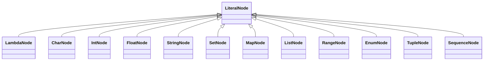

# MERLr3: Monomer

This is a documentation of the Java-coded program structure for the Monomer revision of the MERL interpreter and compiler.  This file includes documentation of the Monomer syntax, module structure, class structures, and program flow logic.

# Syntax

The syntax of Monomer includes 6 main structural types:

 1. Basic Literals
 2. Operators
 3. Variables
 4. Groups
 5. Structured Values 
 6. Comments

## Basic Literals

Monomer has 10 built-in literal constructions:

 1. int
 2. float
 3. char
 4. string
 5. list
 6. set
 7. map
 8. range
 9. enum
 10. tuple 

### int

Ints are any integer number without preceding, succeeding, nor intermittent characters (ie no commas, no dots) except when representing hexadecimal, octal, and binary format integers, which are preceded with prefixes *0x*, *0o*, and *0b*, respectively. 
In the case of hexadecimal literals, the digits for [10...15] are denoted by [A...F], case insensitive. 
Negative integers are created by inverting an integer literal with the negative operator (`-`).
Valid int literals include

    0
    123
    
    0xAB123
    0o123
    0b101

Invalid int literals include

    .99
    1e7
    2.998e8
    0x.99
    
    1,000
    
    0xH99

> The first 4 cases are not int literals, but float literals. 
> The case for *1,000* is that it has a comma. 
> *0xH99* is invalid because *H* is not a hexadecimal digit (the same restrictions also apply to octal and binary numbers)

### float
### char
### string

Strings are a collection of characters that form any length of symbols or words that are taken as-is. Strings are contained by quotation marks (`"..."`). 

Within a string, identifiers, expressions, and certain symbols can be *escaped*, ie they take on values that are different from if they are typed in directly. This is needed for some symbols such as the quotation mark (`"`) and the escape character (`\`) that would otherwise mean differently to the compiler. Escaped sequences occur as an escape character followed by either an identifier, a parenthetically enclosed expression, or either a quotation mark, an escape character, or a new line. Escaped identifiers and expressions will have their evaluated value converted to string and embedded into the string literal.

Valid string literals include

    "Hello, world!"
    
    "this is a \"string\""
    "¯\\_(ツ)_/¯"
    
    "$\(100+20*0.1) annually"
    "VV\tab^^"
    "Hi\(newline)Hello"			
    
> The value of the above lines, when displayed, will respectively be: 
> `Hello, world!`
> `this is a "string"`
> `¯\_(ツ)_/¯`
> `$102.0 annually`
> `VV	^^`
> and the last example will be (on two separate lines)
> `Hi`
> `Hello`
   
Invalid String literals include 

    "this is a "string""
    "¯\_(ツ)_/¯"
    
    "Hi\newlineHello"			

> The first example will have two strings: `"this is a "` and `""` sandwiching the identifier `string` rather than a single string with `"string"` in it. 
> The second example will have the sequence `\_` which implies an *escaped sequence*. 
> The last example will search for `newlineHello` as the identifier.

### list

    [1,2,3,4]

### set

    set{"no", "repeats", "and", "no", "order"}

### map

    map{"alex":1, "bill":2, "carl":3, "david":4}

### range

    [1...4]
    [1...5)
    (0...4]
    (0...5)
    
    [0...x)

> discrete ranges can by created by performing a `by` operation on the range. I.E. `[0...x) by 1` for every integer from 0 to x excluding x

### enum

    enum{a,b,c,d}
    enum{a=0,b,c,d}
    enum{a=9,b=49,c=121,d=225}

> In the first case, a="a", b="b", etc
> In the second case, a=0, b=1, c=2, d=3
> In the last case, each will be given their respective values

### tuple

    a,b,c
    (a,b,c)
    (a,(b,c))

## Operators
## Variables
## Groups

## Structured Values

## Comments

Lastly, to keep a program readable, comments are embedded with the program. Comments contain human-redable information, but evaluate to a space for computers. Comments are styled as follows, where elipsis (`...`) indicates any other code content (excluding comments), `word` indicates any identifier, `space` indicates a space, tab, or new line, and `symbol` indicates any recognized operator symbols (ie `+`, `||`, etc).

    ...\word...
    
    ...\space...
    
    ...\symbol...
    
    ...\\comment to the end of the line
    
    ...\"comment that can be embedded into one line,
	    or be expanded across several lines"\...

Comments are used in situations where code is not self-explanatory, or the beginning of the logic is separated by a lot of code, such as in the following cases.

    c = random(0x000000,0xffffff) \\random background color

> In this case, the use of the variable `c` is unclear, but the following comment clarifies it as a `\random background color`

    view{style = screen style}(
	    menu{style = menu style}(
		    ......
	    )\menu
	    view{style = body style}(
		    ......
	    )\view
    )\view

> In addition to indention, the `\view` and `\menu` comments clarify the function calls that the end parenthesis terminates, the same is also done for brackets and braces.

# Implementation

## Parts of the interpreter-compiler

|Component|Role|
|--|--|
|Tokenizer|takes in a file and breaks it into processable Tokens that have a heirarchial structure that account for parenthesis and tabification|
|Syntax Tree|stores the components of the program in an organized format to be used to find variables, match types, interpreted, or compiled|
|Variable|provides the Variable Key that is shared between occurances of variable identifiers and also describes the type of the variable|
|Interpreter|provides the classes that are used for interpretation|
|Compiler|provides the classes that are used for compilation|

## Classes

|Class|Role|
|--|--|
|Buffer|keeps track of the position of a file while spitting out contents of the file line-by-line. Also allows un-getting part of the most recent line|
|LineContext|the information regarding a token's position, value, and the rest of its line that is used to display errors|
|**Node**|the ancestral class for all syntax tree nodes|
|**ModuleNode**|the node for a folder|
|**IdentifierNode**|the node for a variable. Variables are declared by their first use|
|**OperatorNode**|the node for an operator|
|**LiteralNode**|the node for a literal|
|GenericOperatorNode|any operator that handles only values (ie arithmetic, boolean)|
|AssignNode|used to assign a variable|
|DefineNode|used to define a function|
|FieldNode|used to access a field. Fields are declared by their first use|
|ToNode|converts a value to a copy with the type specified|
|AsNode|treats a value as the type specified|
|CallNode|calls a function|
|ControlNode|ancestral class for the control statement classes|
|LambdaNode|the "value" of a function|
|CharNode||
|StringNode||
|IntNode||
|FloatNode||
|SetNode||
|MapNode||
|ListNode||
|RangeNode||
|EnumNode||
|TupleNode|a structured list with any type children|
|SequenceNode|a flat list|
|VariableKey|the Key of a variable that is shared between identifiers referring to the same variable. Doubles as the type, and, during interpretation, the value|
|FunctionKey||
|InterpretVariable|requested from nodes for interpreter actions that require variable modification|
|InterpretValue|requested from nodes for interpreter actions that require values|
|CompileSize|a union of an int or a Node that evaluates to an int that provides the size of something during runtime|
|CompileMemory|where a variable will be at runtime|
|CompileValue|where a value will be at runtime|

## UML diagrams

And this will produce a flow chart:

<!--stackedit_data:
eyJoaXN0b3J5IjpbLTU0MjQ1NzE3MCw3ODkzMDIxOTcsMjA1NT
c2NjI3MCwxNTg2NjM3MzQzLC04MzYwNjU5MTldfQ==
-->