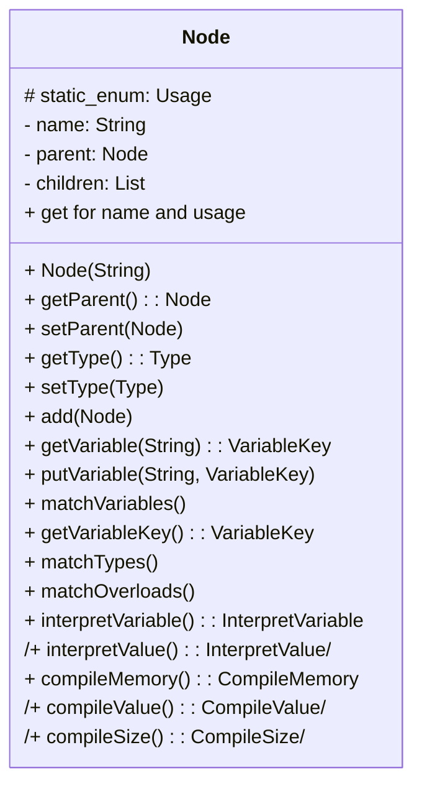

```mermaid
classDiagram
class Node{
 # static_enum: Usage  
 - name: String  
 - parent: Node  
 - children: List<Node>
 + Node(String)  
+ getParent(): Node
+ setParent(Node) 
+ getType(): Type
+ setType(Type)
+ get for name and usage  
+ add(Node)  
+ getVariable(String): VariableKey  
+ putVariable(String, VariableKey)  
+ matchVariables()  
+ getVariableKey(): VariableKey  
+ matchTypes()  
+ matchOverloads()  
+ interpretVariable() : InterpretVariable  
/+ interpretValue() : InterpretValue/  
+ compileMemory() : CompileMemory  
/+ compileValue() : CompileValue/  
/+ compileSize() : CompileSize/
 }
```
<!--stackedit_data:
eyJoaXN0b3J5IjpbNzE0NjY3MjkyXX0=
-->