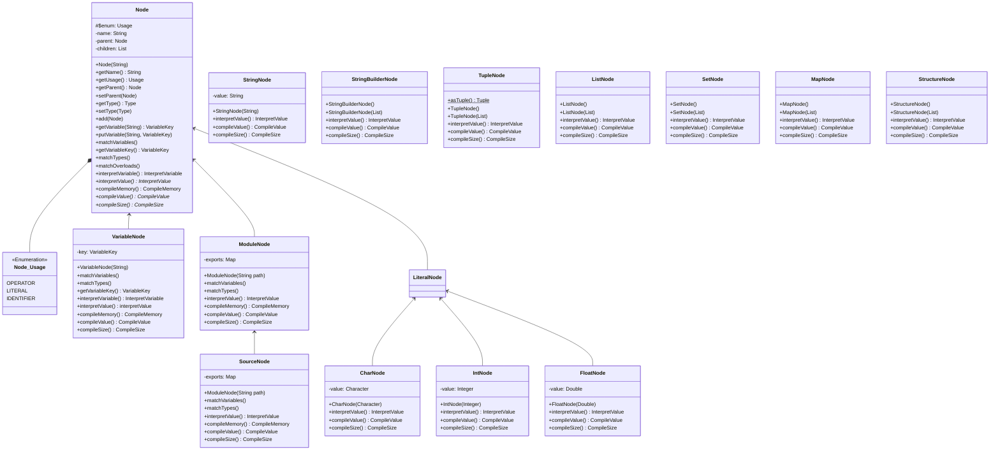

note for Node "getVariableKey will default to null. interpretVariable and compileMemory will default to error. compileMemory is the location of a variable while compileValue can also specify calculations, constant value or register location"

<!--stackedit_data:
eyJoaXN0b3J5IjpbLTI1MTI2NTAxMl19
-->