note for SourceIndex "x and y will be the indices [0...), whereas row and col will be the positions [1...)"

note for SourceContext "toString will be the string from the source; errorString will have the source title and be underlined"

note for ErrorBlock "throws a SyntaxError with context printed along with msg"

note for Node "getVariableKey will default to null. interpretVariable and compileMemory will default to error. compileMemory is the location of a variable while compileValue can also specify calculations, constant value or register location"

note for StringBuilderNode "parts being built together will be stored in children"

```mermaid
classDiagram

class SourceIndex{
	-x: int
	-y: int
	+SourceIndex(int x, int y)  
	+getRow() int  
	+getCol() int
	+getX() int  
	+getY() int
}
class SourceContext{
	-source: Source  
	-start: Index  
	-end: Index
}
class ErrorBlock{
	-context: SourceContext
	+throwError(String msg)  
	+setContext(context)
}
class Source{
	<<abstract>>
	+$class Line  
	+$class Token  
	+buffer: Deque<Line>  
	-int y
	+getLine() Line  
	+ungetLine(Line)  
	#bufferLines(int num)*  
	+parse(): Token  
	+parseStringLiteral() Token  
	+parseNumberLiteral() Token  
	+parseIdentifier()* Token  
	+getTitle()* String
}
class SourceFile{
	+reader: FileReader  
	+file: File  
	+fileName: String
	+SourceFile(String path)  
	#bufferLines(int num)  
	+getTitle() String
}
class SourceString{
	-value: String
	+SourceString(String)  
	#bufferLines(int num)  
	+getTitle() String
}
class Line{
	-String line  
	-int x  
	-int y
	+Line(String, int y)  
	+getSourceIndex() SourceIndex  
	+peek() char  
	+get() chat  
	+unget()  
	+startingSpaces() int  
	+skipSpaces() int  
	+matchNext(List<String>) String  
	+matchNext(String) boolean
}
class Token{
	+$enum Usage
	-String value  
	-List<Token> children  
	-type: TokenType
	+Token(Type, String)  
	+Token(Type)  
	+toNode() Node  
	+with(String value) this
}
class Token_Usage{
	<<enumeration>>
	OPERATOR
	STRING_BUILDER
	STRING
	CHARACTER
	INTEGER
	FLOAT
	GROUP
}

SourceContext o-- SourceIndex
ErrorBlock--o SourceContext
Source --o SourceContext
Source <-- SourceFile
Source <-- SourceString
Source o-- Token
Source *-- Line
Token *-- Token_Usage


class Node{
	<<abstract>>
	#$enum: Usage
	-name: String  
	-parent: Node  
	-children: List<Node>
	+Node(String)  
	+getName() String
	+getUsage()* Usage
	+getParent() Node
	+setParent(Node) 
	+getType() Type
	+setType(Type) 
	+add(Node)
	+size() int
	+getVariable(String) VariableKey  
	+putVariable(String, VariableKey)  
	+matchVariables()  
	+getVariableKey() VariableKey  
	+matchTypes()  
	+matchOverloads()  
	+interpretVariable() InterpretVariable  
	+interpretValue()* InterpretValue
	+compileMemory() CompileMemory  
	+compileValue()* CompileValue 
	+compileSize()* CompileSize
}
class Node_Usage{
	<<Enumeration>>
	OPERATOR
	LITERAL
	IDENTIFIER
	MODULE
}
class VariableNode{
	-key: VariableKey
	+VariableNode(String)
	+getUsage() Usage
	+matchVariables()
	+getVariableKey() VariableKey  
	+interpretVariable() InterpretVariable  
	+interpretValue() interpretValue  
	+compileMemory() CompileMemory  
	+compileValue() CompileValue  
	+compileSize() CompileSize
}
class ModuleNode{
	-exports: Map<String,VariableKey>
	+ModuleNode(String path)
	+getUsage() Usage
	+interpretValue() InterpretValue  
	+compileMemory() CompileMemory  
	+compileValue() CompileValue  
	+compileSize() CompileSize
}
class SourceNode{
	-exports: Map<String,VariableKey>
	+ModuleNode(String path)
	+interpretValue() InterpretValue  
	+compileMemory() CompileMemory  
	+compileValue() CompileValue  
	+compileSize() CompileSize
}
class LiteralNode{
	+getUsage() Usage
}
class CharNode{
	-value: Character
	+CharNode(Character)
	+interpretValue() InterpretValue  
	+compileValue() CompileValue  
	+compileSize() CompileSize
}
class IntNode{
	-value: Integer
	+IntNode(Integer)
	+interpretValue() InterpretValue  
	+compileValue() CompileValue  
	+compileSize() CompileSize
}
class FloatNode{
	-value: Double
	+FloatNode(Double)
	+interpretValue() InterpretValue  
	+compileValue() CompileValue  
	+compileSize() CompileSize
}
class StringNode{
	-value: String
	+StringNode(String)
	+interpretValue() InterpretValue  
	+compileValue() CompileValue  
	+compileSize() CompileSize
}
class StringBuilderNode{
	+StringBuilderNode()
	+StringBuilderNode(List<Node>)
	+interpretValue() InterpretValue  
	+compileValue() CompileValue  
	+compileSize() CompileSize
}
class TupleNode{
	+asTuple() Tuple$
	+TupleNode()
	+TupleNode(List<Node>)
	+interpretValue() InterpretValue  
	+compileValue() CompileValue  
	+compileSize() CompileSize
}
class ListNode{
	+ListNode()
	+ListNode(List<Node>)
	+interpretValue() InterpretValue  
	+compileValue() CompileValue  
	+compileSize() CompileSize
}
class SetNode{
	+SetNode()
	+SetNode(List<Node>)
	+interpretValue() InterpretValue  
	+compileValue() CompileValue  
	+compileSize() CompileSize
}
class MapNode{
	+MapNode()
	+MapNode(List<Node>)
	+interpretValue() InterpretValue  
	+compileValue() CompileValue  
	+compileSize() CompileSize
}
class StructureNode{
	+StructureNode()
	+StructureNode(List<Node>)
	+putVariable(String, VariableKey)
	+matchTypes()
	+interpretValue() InterpretValue  
	+compileValue() CompileValue  
	+compileSize() CompileSize
}

class OperatorNode{
	+getUsage() Usage  
	+getFirst() Node  
	+getSecond() Node
}
class FieldOperatorNode{
	-key: VariableKey
	+FieldOperatorNode()  
	+getVariableKey() VariableKey  
	+matchVariables()  
	+matchTypes()  
	+interpretVariable() InterpretVariable  
	+interpretValue() InterpretValue  
	+compileMemory() CompileMemory  
	+compileValue() CompileValue  
	+compileSize() CompileSize
}
class AssignOperatorNode{
	+AssignOperatorNode()  
	+matchTypes()  
	+interpretVariable() InterpretVariable  
	+interpretValue() InterpretValue  
	+compileMemory() CompileMemory  
	+compileValue() CompileValue  
	+compileSize() CompileSize
}
class DefineOperatorNode{
	-variables: Map<String,systems.merl.monomer.variables.VariableKey>
	+DefineOperatorNode()  
	+matchTypes()  
	+putVariable(String, systems.merl.monomer.variables.VariableKey)  
	+getVariable(String) systems.merl.monomer.variables.VariableKey  
	+interpretVariable() InterpretVariable  
	+interpretValue() InterpretValue  
	+compileMemory() CompileMemory  
	+compileValue() CompileValue  
	+compileSize() CompileSize
}
class GenericOperatorNode{
	-interpret: Function<List<InterpretValue>,InterpretValue>  
	-compileSize: CompileSize  
	-compile: Function<List<Node>,CompileValue>
	+GenericOperatorNode()  
	+matchTypes()  
	+interpretValue() InterpretValue  
	+compileValue() CompileValue  
	+compileSize() CompileSize
}
class CastOperatorNode{
	+CastOperatorNode()  
	+matchTypes()  
	+interpretVariable() InterpretVariable  
	+interpretValue() InterpretValue  
	+compileMemory() CompileMemory  
	+compileValue() CompileValue  
	+compileSize() CompileSize
}
class ConvertOperatorNode{
	+ConvertOperatorNode()  
	+matchTypes()  
	+interpretValue() InterpretValue  
	+compileValue() CompileValue  
	+compileSize() CompileSize
}
class ControlGroupNode{
	+ControlGroupNode()  
	+matchTypes()  
	+ interpretValue() InterpretValue  
	+ compileValue() CompileValue  
	+ compileSize() CompileSize
}
class ControlOperatorNode{
	<<abstract>> 
	-variables: Map<String,systems.merl.monomer.variables.VariableKey>
	+ControlOperatorNode()  
	+matchTypes()  
	+putVariable(String, systems.merl.monomer.variables.VariableKey)  
	+getVariable(String) systems.merl.monomer.variables.VariableKey  
	+interpretValue() InterpretValue  
	+compileValue() CompileValue  
	+compileSize() CompileSize
}
class IfNode{
	+interpretValue() InterpretValue  
	+compileValue() CompileValue  
	+compileSize() CompileSize
}
class ElseNode{
	+interpretValue() InterpretValue  
	+compileValue() CompileValue  
	+compileSize() CompileSize
}
class AnyNode{
	+interpretValue() InterpretValue  
	+compileValue() CompileValue  
	+compileSize() CompileSize
}
class RepeatNode{
	+interpretValue() InterpretValue  
	+compileValue() CompileValue  
	+compileSize() CompileSize
}
class WhileNode{
	+interpretValue() InterpretValue  
	+compileValue() CompileValue  
	+compileSize() CompileSize
}
class ForNode{
	+interpretValue() InterpretValue  
	+compileValue() CompileValue  
	+compileSize() CompileSize
}

Node *-- Node_Usage
Node <-- ModuleNode
Node <-- VariableNode
Node <-- LiteralNode
Node <-- OperatorNode

ModuleNode <-- SourceNode

LiteralNode <-- CharNode
LiteralNode <-- IntNode
LiteralNode <-- FloatNode
LiteralNode <-- StringNode
LiteralNode <-- StringBuilderNode
LiteralNode <-- TupleNode
LiteralNode <-- ListNode
LiteralNode <-- SetNode
LiteralNode <-- MapNode
LiteralNode <-- StructureNode

OperatorNode <-- FieldOperatorNode
OperatorNode <-- CastOperatorNode
OperatorNode <-- ConvertOperatorNode
OperatorNode <-- AssignOperatorNode
OperatorNode <-- ControlOperatorNode
OperatorNode <-- ControlGroupNode
OperatorNode <-- GenericOperatorNode

AssignOperatorNode <-- DefineOperatorNode

ControlOperatorNode <-- IfNode
ControlOperatorNode <-- ElseNode
ControlOperatorNode <-- AnyNode
ControlOperatorNode <-- RepeatNode
ControlOperatorNode <-- WhileNode
ControlOperatorNode <-- ForNode

ControlGroupNode o-- ControlOperatorNode

ErrorBlock <-- Token
ErrorBlock <-- Node

class systems.merl.monomer.variables.VariableKey{
	-interpretValue: InterpretValue
	-parent: systems.merl.monomer.variables.VariableKey
}
class systems.merl.monomer.variables.Type{
	<<abstract>>
	-Map<String, systems.merl.monomer.variables.Type> children
	+put(String, systems.merl.monomer.variables.Type)
	+get(String) InterpretValue
	+typeContains(systems.merl.monomer.variables.Type) bool
	+getFields() Map<String,systems.merl.monomer.variables.Type>
}
class InterpretValue{
	+put(String, InterpretValue)
	+get(String) InterpretValue
	+setValue(InterpretValue)
	+valueString() String
	+typeContains(systems.merl.monomer.variables.Type) bool
	+copy() systems.merl.monomer.variables.VariableKey
}
class InterpretBool{
	+setValue(Bool)
	+valueString() String
	+typeContains(systems.merl.monomer.variables.Type) bool
	+copy() systems.merl.monomer.variables.VariableKey
}
class InterpretInt{
	+setValue(Integer)
	+valueString() String
	+typeContains(systems.merl.monomer.variables.Type) bool
	+copy() systems.merl.monomer.variables.VariableKey
}
class InterpretFloat{
	+setValue(Float)
	+valueString() String
	+typeContains(systems.merl.monomer.variables.Type) bool
	+copy() systems.merl.monomer.variables.VariableKey
}
class InterpretChar{
	+setValue(Char)
	+valueString() String
	+typeContains(systems.merl.monomer.variables.Type) bool
	+copy() systems.merl.monomer.variables.VariableKey
}
class InterpretString{
	+setValue(String)
	+valueString() String
	+typeContains(systems.merl.monomer.variables.Type) bool
	+copy() systems.merl.monomer.variables.VariableKey
}
class InterpretArray{
	+add(InterpretValue)
	+valueString() String
	+typeContains(systems.merl.monomer.variables.Type) bool
	+copy() systems.merl.monomer.variables.VariableKey
}
class InterpretSet{
	+add(InterpretValue)
	+valueString() String
	+typeContains(systems.merl.monomer.variables.Type) bool
	+copy() systems.merl.monomer.variables.VariableKey
}
class InterpretMap{
	+add(InterpretValue,InterpretValue)
	+valueString() String
	+typeContains(systems.merl.monomer.variables.Type) bool
	+copy() systems.merl.monomer.variables.VariableKey
}

systems.merl.monomer.variables.Type <-- InterpretValue

InterpretValue <-- InterpretBool
InterpretValue <-- InterpretInt
InterpretValue <-- InterpretFloat
InterpretValue <-- InterpretChar
InterpretValue <-- InterpretString
InterpretValue <-- InterpretArray
InterpretValue <-- InterpretSet
InterpretValue <-- InterpretMap

InterpretValue <-- VariableKey

VariableNode o-- VariableKey
FieldOperatorNode o-- VariableKey
```

<!--stackedit_data:
eyJoaXN0b3J5IjpbMTM1MTkyOTQ1NCwxMDU5OTM2OTQsMjA1MT
Y5NzE3OCwtNzIwMjgzMDc5LC0yODM4NDAxODgsLTEwODg4MDcw
MjAsLTEwODg4MDcwMjAsLTkyMjE3Njk4Nl19
-->