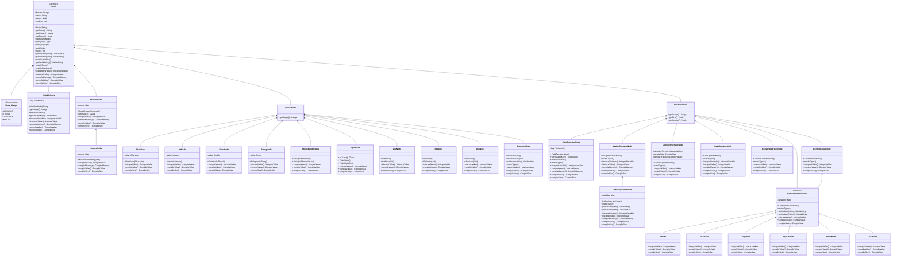

```mermaid
classDiagram

class Node{
	<<abstract>>
	#$enum: Usage
	-name: String  
	-parent: Node  
	-children: List<Node>
	+Node(String)  
	+getName() String
	+getUsage()* Usage
	+getParent() Node
	+setParent(Node) 
	+getType() Type
	+setType(Type) 
	+add(Node)
	+size() int
	+getVariable(String) VariableKey  
	+putVariable(String, VariableKey)  
	+matchVariables()  
	+getVariableKey() VariableKey  
	+matchTypes()  
	+matchOverloads()  
	+interpretVariable() InterpretVariable  
	+interpretValue()* InterpretValue
	+compileMemory() CompileMemory  
	+compileValue()* CompileValue 
	+compileSize()* CompileSize
}
class Node_Usage{
	<<Enumeration>>
	OPERATOR
	LITERAL
	IDENTIFIER
	MODULE
}
class VariableNode{
	-key: VariableKey
	+VariableNode(String)
	+getUsage() Usage
	+matchVariables()
	+getVariableKey() VariableKey  
	+interpretVariable() InterpretVariable  
	+interpretValue() interpretValue  
	+compileMemory() CompileMemory  
	+compileValue() CompileValue  
	+compileSize() CompileSize
}
class ModuleNode{
	-exports: Map<String,VariableKey>
	+ModuleNode(String path)
	+getUsage() Usage
	+interpretValue() InterpretValue  
	+compileMemory() CompileMemory  
	+compileValue() CompileValue  
	+compileSize() CompileSize
}
class SourceNode{
	-exports: Map<String,VariableKey>
	+ModuleNode(String path)
	+interpretValue() InterpretValue  
	+compileMemory() CompileMemory  
	+compileValue() CompileValue  
	+compileSize() CompileSize
}
class LiteralNode{
	+getUsage() Usage
}
class CharNode{
	-value: Character
	+CharNode(Character)
	+interpretValue() InterpretValue  
	+compileValue() CompileValue  
	+compileSize() CompileSize
}
class IntNode{
	-value: Integer
	+IntNode(Integer)
	+interpretValue() InterpretValue  
	+compileValue() CompileValue  
	+compileSize() CompileSize
}
class FloatNode{
	-value: Double
	+FloatNode(Double)
	+interpretValue() InterpretValue  
	+compileValue() CompileValue  
	+compileSize() CompileSize
}
class StringNode{
	-value: String
	+StringNode(String)
	+interpretValue() InterpretValue  
	+compileValue() CompileValue  
	+compileSize() CompileSize
}
class StringBuilderNode{
	+StringBuilderNode()
	+StringBuilderNode(List<Node>)
	+interpretValue() InterpretValue  
	+compileValue() CompileValue  
	+compileSize() CompileSize
}
class TupleNode{
	+asTuple() Tuple$
	+TupleNode()
	+TupleNode(List<Node>)
	+interpretValue() InterpretValue  
	+compileValue() CompileValue  
	+compileSize() CompileSize
}
class ListNode{
	+ListNode()
	+ListNode(List<Node>)
	+interpretValue() InterpretValue  
	+compileValue() CompileValue  
	+compileSize() CompileSize
}
class SetNode{
	+SetNode()
	+SetNode(List<Node>)
	+interpretValue() InterpretValue  
	+compileValue() CompileValue  
	+compileSize() CompileSize
}
class MapNode{
	+MapNode()
	+MapNode(List<Node>)
	+interpretValue() InterpretValue  
	+compileValue() CompileValue  
	+compileSize() CompileSize
}
class StructureNode{
	+StructureNode()
	+StructureNode(List<Node>)
	+putVariable(String, VariableKey)
	+matchTypes()
	+interpretValue() InterpretValue  
	+compileValue() CompileValue  
	+compileSize() CompileSize
}

class OperatorNode{
	+getUsage() Usage  
	+getFirst() Node  
	+getSecond() Node
}
class FieldOperatorNode{
	-key: VariableKey
	+FieldOperatorNode()  
	+getVariableKey() VariableKey  
	+matchVariables()  
	+matchTypes()  
	+interpretVariable() InterpretVariable  
	+interpretValue() InterpretValue  
	+compileMemory() CompileMemory  
	+compileValue() CompileValue  
	+compileSize() CompileSize
}
class AssignOperatorNode{
	+AssignOperatorNode()  
	+matchTypes()  
	+interpretVariable() InterpretVariable  
	+interpretValue() InterpretValue  
	+compileMemory() CompileMemory  
	+compileValue() CompileValue  
	+compileSize() CompileSize
}
class DefineOperatorNode{
	-variables: Map<String,VariableKey>
	+DefineOperatorNode()  
	+matchTypes()  
	+putVariable(String, VariableKey)  
	+getVariable(String) VariableKey  
	+interpretVariable() InterpretVariable  
	+interpretValue() InterpretValue  
	+compileMemory() CompileMemory  
	+compileValue() CompileValue  
	+compileSize() CompileSize
}
class GenericOperatorNode{
	-interpret: Function<List<InterpretValue>,InterpretValue>  
	-compileSize: CompileSize  
	-compile: Function<List<Node>,CompileValue>
	+GenericOperatorNode()  
	+matchTypes()  
	+interpretValue() InterpretValue  
	+compileValue() CompileValue  
	+compileSize() CompileSize
}
class CastOperatorNode{
	+CastOperatorNode()  
	+matchTypes()  
	+interpretVariable() InterpretVariable  
	+interpretValue() InterpretValue  
	+compileMemory() CompileMemory  
	+compileValue() CompileValue  
	+compileSize() CompileSize
}
class ConvertOperatorNode{
	+ConvertOperatorNode()  
	+matchTypes()  
	+interpretValue() InterpretValue  
	+compileValue() CompileValue  
	+compileSize() CompileSize
}
class ControlGroupNode{
	+ControlGroupNode()  
	+matchTypes()  
	+ interpretValue() InterpretValue  
	+ compileValue() CompileValue  
	+ compileSize() CompileSize
}
class ControlOperatorNode{
	<<abstract>> 
	-variables: Map<String,VariableKey>
	+ControlOperatorNode()  
	+matchTypes()  
	+putVariable(String, VariableKey)  
	+getVariable(String) VariableKey  
	+interpretValue() InterpretValue  
	+compileValue() CompileValue  
	+compileSize() CompileSize
}
class IfNode{
	+interpretValue() InterpretValue  
	+compileValue() CompileValue  
	+compileSize() CompileSize
}
class ElseNode{
	+interpretValue() InterpretValue  
	+compileValue() CompileValue  
	+compileSize() CompileSize
}
class AnyNode{
	+interpretValue() InterpretValue  
	+compileValue() CompileValue  
	+compileSize() CompileSize
}
class RepeatNode{
	+interpretValue() InterpretValue  
	+compileValue() CompileValue  
	+compileSize() CompileSize
}
class WhileNode{
	+interpretValue() InterpretValue  
	+compileValue() CompileValue  
	+compileSize() CompileSize
}
class ForNode{
	+interpretValue() InterpretValue  
	+compileValue() CompileValue  
	+compileSize() CompileSize
}

Node *-- Node_Usage
Node <-- ModuleNode
Node <-- VariableNode
Node <-- LiteralNode
Node <-- OperatorNode

ModuleNode <-- SourceNode

LiteralNode <-- CharNode
LiteralNode <-- IntNode
LiteralNode <-- FloatNode
LiteralNode <-- StringNode
LiteralNode <-- StringBuilderNode
LiteralNode <-- TupleNode
LiteralNode <-- ListNode
LiteralNode <-- SetNode
LiteralNode <-- MapNode
LiteralNode <-- StructureNode

OperatorNode <-- FieldOperatorNode
OperatorNode <-- CastOperatorNode
OperatorNode <-- ConvertOperatorNode
OperatorNode <-- AssignOperatorNode
OperatorNode <-- ControlOperatorNode
OperatorNode <-- ControlGroupNode
OperatorNode <-- GenericOperatorNode

AssignOperatorNode <-- DefineOperatorNode

ControlOperatorNode <-- IfNode
ControlOperatorNode <-- ElseNode
ControlOperatorNode <-- AnyNode
ControlOperatorNode <-- RepeatNode
ControlOperatorNode <-- WhileNode
ControlOperatorNode <-- ForNode

ControlGroupNode o-- ControlOperatorNode
```
<!--stackedit_data:
eyJoaXN0b3J5IjpbMTM4MDA1Njk5XX0=
-->