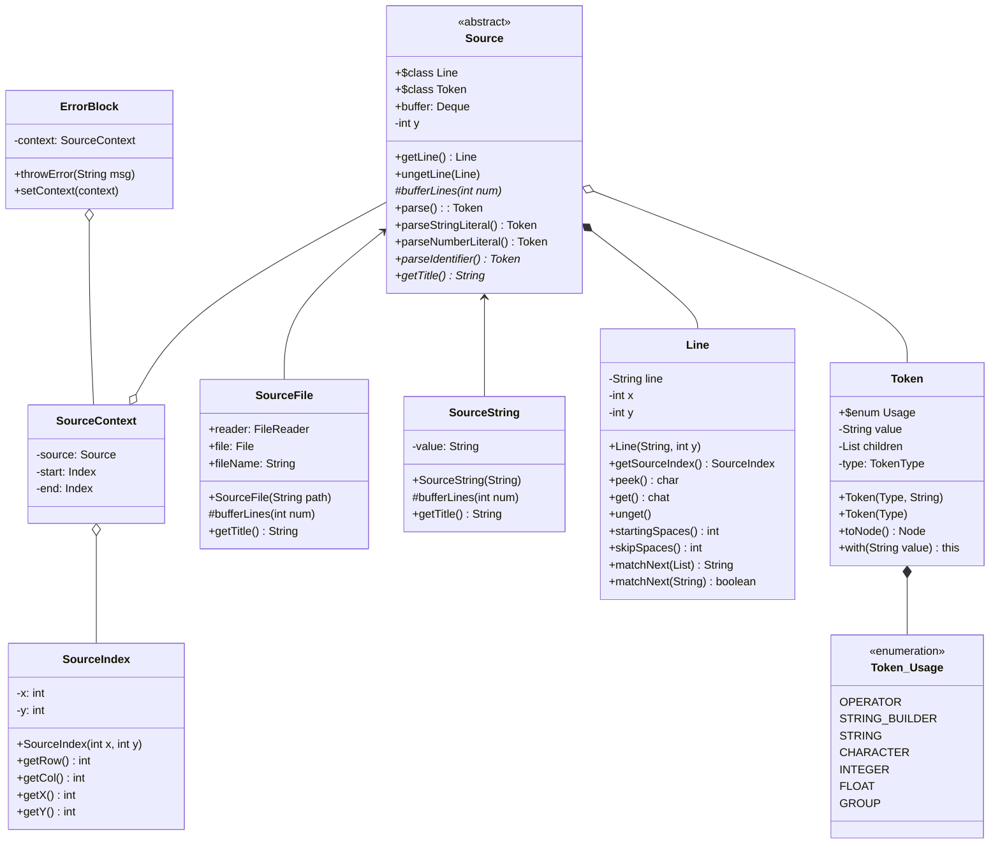

```mermaid
classDiagram
class SourceIndex{
	-x: int
	-y: int
	+SourceIndex(int x, int y)  
	+getRow() int  
	+getCol() int
	+getX() int  
	+getY() int
}
class SourceContext{
	-source: Source  
	-start: Index  
	-end: Index
}
class ErrorBlock{
	-context: SourceContext
	+throwError(String msg)  
	+setContext(context)
}
class Source{
	<<abstract>>
	+$class Line  
	+$class Token  
	+buffer: Deque<Line>  
	-int y
	+getLine() Line  
	+ungetLine(Line)  
	#bufferLines(int num)*  
	+parse(): Token  
	+parseStringLiteral() Token  
	+parseNumberLiteral() Token  
	+parseIdentifier()* Token  
	+getTitle()* String
}
class SourceFile{
	+reader: FileReader  
	+file: File  
	+fileName: String
	+SourceFile(String path)  
	#bufferLines(int num)  
	+getTitle() String
}
class SourceString{
	-value: String
	+SourceString(String)  
	#bufferLines(int num)  
	+getTitle() String
}
class Line{
	-String line  
	-int x  
	-int y
	+Line(String, int y)  
	+getSourceIndex() SourceIndex  
	+peek() char  
	+get() chat  
	+unget()  
	+startingSpaces() int  
	+skipSpaces() int  
	+matchNext(List<String>) String  
	+matchNext(String) boolean
}
class Token{
	+$enum Usage
	-String value  
	-List<Token> children  
	-type: TokenType
	+Token(Type, String)  
	+Token(Type)  
	+toNode() Node  
	+with(String value) this
}
class Token_Usage{
	<<enumeration>>
	OPERATOR
	STRING_BUILDER
	STRING
	CHARACTER
	INTEGER
	FLOAT
	GROUP
}

SourceContext o-- SourceIndex
ErrorBlock o-- SourceContext
Source --o SourceContext
Source <-- SourceFile
Source <-- SourceString
Source o-- Token
Source *-- Line
Token *-- Token_Usage
```
<!--stackedit_data:
eyJoaXN0b3J5IjpbLTcyMDA1MDg1NV19
-->